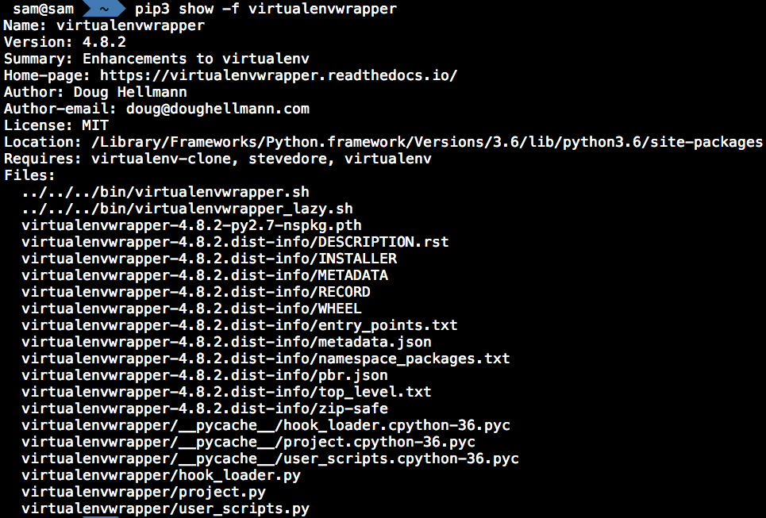
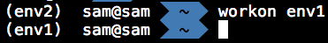
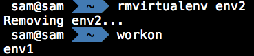

.. _virtual_environment:

*******************
Virtual Environment
*******************

.. _install_python3:

Step1, Install python3
======================

* Method 1 (recommendation)

Go to `Python Official Website<https://www.python.org/downloads/>`, download and 
install a specific release.

* Method 2 

Use HomeBrew, `$ brew install python3` 

Make sure Python3 has been installed successfully, $ python3 -V

.. _install_virtualenvwrapper:

Step2, Install package virtualenvwrapper
========================================

#. `$ pip3 install virtualenvwrapper`, `http://virtualenvwrapper.readthedocs.io/en/latest/`

#. check the package location, `$ pip3 show -f virtualenvwrapper`

#. setup the path for shell zsh

#. create a new environment, `$ mkvirtualenv env1`

#. show the existing environment, `$ workon`, or `$ lsvirtualenv`

.. image:: _static/7.png

#. use an existing environment, or switch between environments, `$ workon env1`

.. image:: _static/8.png

#. You must use deactivate before removing the current environment, `$ deactivate`

.. image:: _static/9.png

#. remove an environment, `$ rmvirtualenv env1`

